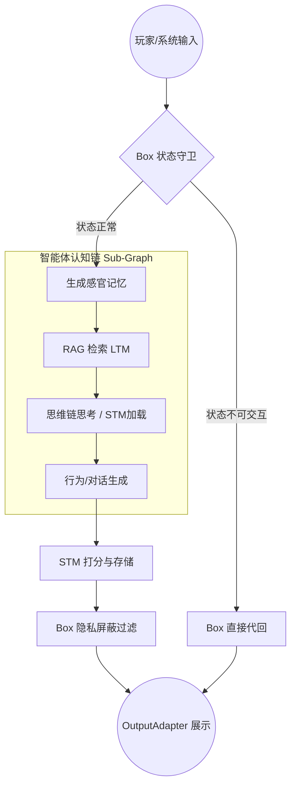

# LangGraph RPG-Agent 系统完整需求与架构设计文档

## 1. 总体概述 (Overview)
本项目旨在构建一个高度拟真的、基于 LangGraph 的虚拟角色扮演系统（RPG-Agent）。
现有的 LLM Agent 普遍存在“随叫随到（缺乏物理限制）”、“性格不连贯（上下文遗忘）”、“缺乏内在动机（无内心独白）”等问题。本系统通过**系统与意识解耦**、**三级记忆存储**和**内心独白屏蔽机制**，打造一个具备真实世界观约束、独立自主生活轨迹以及强“活人感”的下一代智能体系统。

---

## 2. 功能需求 (Functional Requirements)

### 2.1 系统容器 (Box Orchestrator)
Box 是系统的“物理法则”与“过滤器”，拥有绝对的最高控制权，确保世界规则的优先级高于智能体的意愿。
- **状态守卫 (Status Guard)**：
  - 系统需维护 `Agent_Status`（如：`NORMAL` 正常, `SLEEPING` 睡觉, `WORKING` 工作, `UNCONSCIOUS` 昏迷等）。
  - **拦截机制**：当玩家输入到达时，Box 首先检查状态。若状态为“不可交互”（如正在睡觉），Box 必须直接拦截请求并生成系统级回复（如“NPC正在熟睡，没有听到你的声音”），**绝对阻断**流量进入大模型侧，避免消耗 Token 及破坏逻辑。
- **感官合成 (Sensory Generator)**：
  - 将玩家的输入指令与系统环境事件（如天气变化、时间流逝）统一合成为结构化的**感官数据**。
  - 示例：玩家输入“拍拍他的肩膀” -> 转化为感官记忆“你感觉到有人拍了拍你的肩膀”。
- **隐私屏蔽 (Privacy Filter)**：
  - 智能体在处理信息时会产生包括“内心独白 (SoT)”在内的全量输出。
  - Box 必须在最终输出给玩家前，严格执行过滤，**剔除内心独白**，仅将外显的“对话 (Speech)”和“动作 (Action)”展示给玩家，制造信息差与角色深度。

### 2.2 三级记忆架构 (Memory System)
模拟人类记忆的遗忘与固化机制，解决上下文爆炸问题。
- **感官记忆 (Sensory Memory)**：
  - **定位**：极短期缓存，仅在当前单次 Graph 运行周期内存活。
  - **内容**：当前地点、天气、NPC 生理数值（饥饿度、疲劳度）、刚发生的即时事件。
- **短期记忆 (Short-term Memory, STM)**：
  - **定位**：工作内存，维持近期对话与心理状态的连贯性。
  - **机制**：带有重要性 (Importance) 和时间戳 (Timestamp)。
  - **遗忘算法**：采用时间衰减公式 $V = I \cdot e^{-\lambda(T_{now} - T_{created})}$。当 STM 的 Token 总量超过设定阈值（如 4k tokens）时，系统自动清理 $V$ 值最低的记忆片段。
  - **特有内容**：除了对话事实，还需强制记录智能体近期的心理变化 (SoT 摘要)，确保情绪演进自然。
- **长期记忆 (Long-term Memory, LTM)**：
  - **定位**：核心人格、世界观与长期事实库。
  - **存储**：基于向量数据库进行语义存储。
  - **异步固化 (Consolidation)**：系统需定期（如每 20 轮对话，或在进入“睡觉”状态时）触发后台任务，调用 LLM 对 STM 进行提炼，提取“核心事实”和“关系变动”，并持久化至 LTM 中。

### 2.3 智能体认知循环 (Agent Cognitive Loop)
智能体本身作为一个 Sub-Graph 运行，必须包含以下标准化思考链条：
1. **感知过滤 (Perceive)**：接收感官记忆，决定当前的“注意力焦点”（例如，虽然玩家在说话，但 NPC 决定无视，继续专注于看书）。
2. **联想检索 (Recall)**：基于注意力焦点生成 Query，触发 RAG 从 LTM 中提取相关的背景设定或历史记忆。
3. **深度思考 (SoT / Planning)**：在内部进行逻辑推演。分析当前局势、自身动机、玩家意图，并决定应对策略。
4. **行为决策 (Act)**：输出标准化的 JSON 结构，必须包含：
   - `Speech`: 对外说出的话。
   - `Action`: 身体动作或表情描写。
   - `SoT`: 真实的内心想法。
   - `Status_Change`: （可选）向 Box 申请改变自身状态（如申请变更为 `SLEEPING`）。

### 2.4 “活人感”外显系统 (Evidence of Life)
- **后台时间流逝 (Tick)**：
  - 系统需具备独立的时间循环机制。如果玩家长时间未交互，系统应自动向 Box 注入环境事件（如“天黑了”）。
  - NPC 可根据环境变化产生自发行为，甚至主动向玩家发起交互（如主动发消息问候）。
- **虚拟朋友圈 (Moments) 异步生成**：
  - **触发条件**：当 `Agent_Status` 发生重大转变（如下班、旅游、生病）或完成重要事件时触发。
  - **执行流**：LLM 提取近期 LTM 摘要 -> 转化为文案与图像 Prompt -> （预留接口）调用多模态模型生成照片 -> 广播至系统的展示面板。

---

## 3. 架构需求 (Architectural Requirements)

### 3.1 核心架构分层
系统严格分为三层，各层之间通过明确的 State 传递数据：
1. **持久化层 (Memory Layer)**：Redis/PostgreSQL (存储 STM 与 Box 状态) + Milvus/PGVector (存储 LTM)。
2. **系统层 (Box Layer)**：负责流量拦截、感官合成与输出过滤。
3. **认知层 (Agent Layer)**：被封装为 LangGraph 的 Sub-Graph，仅负责纯粹的认知与决策。

### 3.2 插件化 I/O 架构 (Plugin-based I/O)
- **抽象解耦**：系统输入与输出必须与业务逻辑完全分离。不支持在业务代码中直接写死 `print()` 或 `input()`。
- **接口定义**：
  - 定义 `InputAdapter` 接口，包含异步的 `receive()` 方法。
  - 定义 `OutputAdapter` 接口，包含异步的 `render(speech, action)` 方法。
- **实现支持**：初期必须实现 `ConsoleAdapter`（用于本地终端调试），架构上需保证未来能够无缝接入 `FastAPI/WebSocket Adapter`（用于网页或游戏客户端接入）。

### 3.3 LangGraph 工作流设计


---

## 4. 代码规范与工程标准 (Coding Standards)

为了支撑宏大的系统并保证可维护性，必须严格遵守以下 Clean Code 规范：

### 4.1 SOLID 原则与单一职责
- **单一职责原则 (SRP)**：每个类或函数只做一件事。例如，`STM` 类只负责短时记忆的增删改查与衰减计算，不负责与 LLM 通信；`PrivacyFilter` 只负责清洗字段，不负责逻辑判断。
- **依赖倒置原则 (DIP)**：高层模块不应依赖低层模块，二者都应依赖其抽象。例如 Box 不直接依赖具体的控制台输出，而是依赖 `OutputAdapter` 接口。

### 4.2 目录结构规范
强制使用清晰的领域驱动设计 (DDD) 目录结构：
```text
/src
  ├── io/                 # I/O 插件适配器 (ConsoleAdapter, BaseAdapter)
  ├── box/                # 系统容器 (StatusGuard, PrivacyFilter, SensoryGen)
  ├── memory/             # 记忆系统 (Sensory, STM, LTM, Consolidation)
  ├── agent/              # 认知节点逻辑与 Prompt 模板 (Perceive, Recall, SoT, Act)
  ├── graph/              # LangGraph 状态定义 (State TypedDict) 与工作流组装
  ├── core/               # 全局配置、基础数据模型 (Pydantic Models) 与工具类
  └── main.py             # 系统入口点，负责依赖注入与图启动
```

### 4.3 代码风格与类型提示 (Type Hinting)
- **强制类型标注**：所有的函数参数、返回值必须包含完整的 Python Type Hints（使用 `typing` 模块或 Python 3.10+ 原生类型）。
- **数据验证**：与 LLM 交互的结构化数据（如 Agent 的 JSON 输出、Memory 的数据结构）强制使用 `Pydantic` 进行解析和校验。
- **文档注释 (Docstrings)**：所有类、核心方法必须包含 Google Style 或 Sphinx 风格的 Docstring，清晰描述参数、返回值与异常。单文件代码量建议控制在 300 行以内，超过则进行合理拆分。

### 4.4 错误处理与日志规范 (Error Handling & Logging)
- **日志抽象**：严禁使用裸 `print()` 进行调试。必须使用标准 `logging` 模块（或 `loguru`），配置不同级别（INFO, DEBUG, ERROR）。
- **执行流追踪**：LangGraph 的每个节点在进入和退出时，必须打印 DEBUG 级别的日志，记录当前 State 的关键变化，以便于回溯复杂的认知链条。
- **容错机制**：对于 LLM 接口调用、数据库读写等外部依赖操作，必须包含 `try-except` 块及重试逻辑，当 LLM 返回非预期 JSON 时，系统需具备 fallback（回退）机制。
